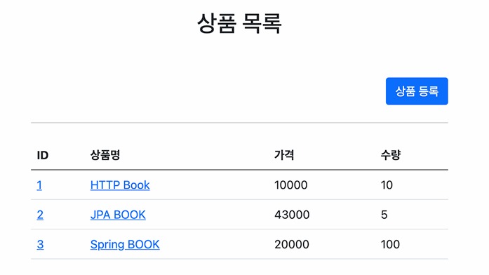
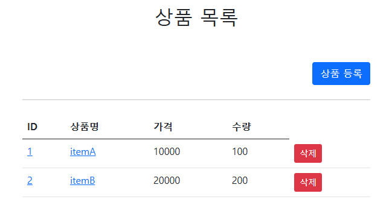

# 상품 관리 서비스 (Item Service)

---

인프런 김영한 님의 [스프링 MVC 1편 - 백엔드 웹 개발 핵심 기술 강좌](https://www.inflearn.com/course/%EC%8A%A4%ED%94%84%EB%A7%81-mvc-1)를 참고하여 CRUD 기능을 완성하였음

## 1. 프로젝트 개요

- 목적: 스프링 MVC 핵심 아키텍처 및 서비스 개발의 전반적인 흐름(CRUD) 체득

- 핵심 학습 내용:
  - HTTP 요청 파라미터를 자바 객체로 바인딩하는 메커니즘 학습 
  - 서버 사이드 렌더링(Thymeleaf)을 활용한 동적 화면 구성 및 데이터 전송
  - PRG(Post-Redirect-Get) 패턴을 통한 웹 페이지 흐름 제어 및 중복 등록 방지
- **특이사항**: 강의 커리큘럼에서 제공되지 않은 **'상품 삭제'** 로직을 직접 설계 및 추가 구현하여 CRUD 사이클을 완성함

  
  

<i>(좌) 원본 상품 목록 / (우) 삭제 버튼이 추가된 수정 후 화면</i>

## 2. 기술 스택

- Backend: Java 21, SpringBoot 3.5.10
- Frontend: Thymeleaf, Bootstrap 5
- Storage: Memory-based HashMap (DB 연동 예정)

## 3. 핵심 구현 사항

### **PRG 패턴을 활용한 새로고침 버그 해결**

- 문제점: 상품 등록, 수정, 삭제 후 새로고침 시 POST 요청이 중복 전송되는 현상 확인
- 해결: 처리 후 결과 화면을 직접 렌더링하지 않고 상세 페이지로 redirect 처리; 브라우저의 마지막 요청을 GET으로 유도하여 중복 전송 원천 차단

### **@ModelAttribute 기반 추상화 적용**

- Form 파라미터를 @ModelAttribute를 사용해 객체 필드에 자동 매핑하여 생산성 및 가독성 향상

### **상품 삭제 기능 구현**

- HTML Form의 한계 (GET/POST only)를 극복하기 위해 POST로 삭제를 구현
- **특이사항**: DELETE는 멱등성을 만족하는 메서드이지만 redirect를 사용하지 않은 경우, 상품 목록 재호출 로직 중복 문제, URI에 기록이 남는 문제, 새로고침 시 양식 다시 제출 확인 알림
  등의 문제가 존재하여 redirect를 적용해야 하였음.

## 4. 향후 과제

- Repository를 ConcurrentHashMap, AtomicLong 등으로 수정하여 멀티스레드 환경 대응
